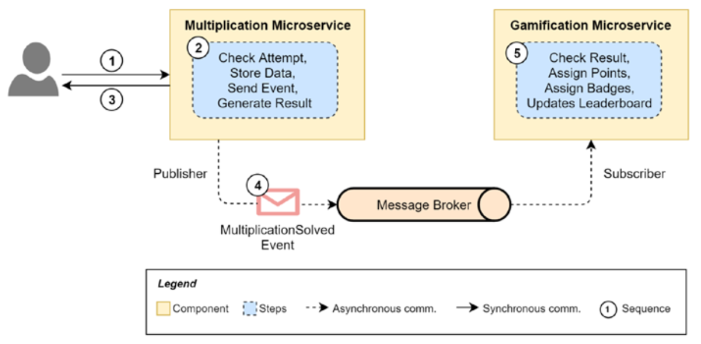

# math-wondo

The purpose of this project is to learn the concept of microservices using java spring boot. I am using Learn Microservices with Spring Boot book as a reference.
Along the way, we are going to build a math battle game application as a result. This book follow agile approach throughout the book to make it more practical.
An agile way of working in which requirements come in the form of user stories.

## Business Requirement

In this project, we want to develop an application to encourage users to train their math skills every day. To begin with, we will have two-digit multiplications presented to users,
one every time they access the page. They will type their alias (a short name) and the result of the opration, and for that they should use only mental calculation.
After they send the data, a success or failure result will be presented.

In orders to motivated the users, we will also introduce some simple gamification technique: a ranking of users based on points they get when they try the calculation every day,
and also when they succed. We willl show this on the results page.

##### User Story 1

As a user of the application, I want to be presented with a random multiplication that I can solve online--not too easy, so I can use
mental calculation and make my brain work every day.

###### Goal

Create web app for multiplication game

###### Acceptance Criteria

1. Create a basic service with the business logic
2. Create a basic API endpoint to access this service
3. Create a basic web page to ask the users to solve that calculation

##### User Story 2

As a user of the application, I want it to show me my last attempt, so I can see how good or bad I'm over time.

###### Goal

Add data persistence to store user attempt

###### Acceptance Criteria

1. Store all instances of the MultiplicationResultAttempt class. That way, we can extract them later.
2. Expose a new REST endpoint to get the latest attempts for a given user.
3. Create a new service (business logic) to retrieve those attempts.
4. Show that attempt's history to the users on the web page after they send a new one.

##### User Story 3

As a user of the application, I want to become more motivated to participate every day, so I don't give up easily

###### Acceptance Criteria

1. Create gamification mechanism to motivated the user of the application
2. Create Points, Badges, and Leaderbords to show user progression
3. Implement Event-Drivent Architecture to seperate `Multiplication` service with `Gamification` service

Logical view of the interactions between the two microservices: 

